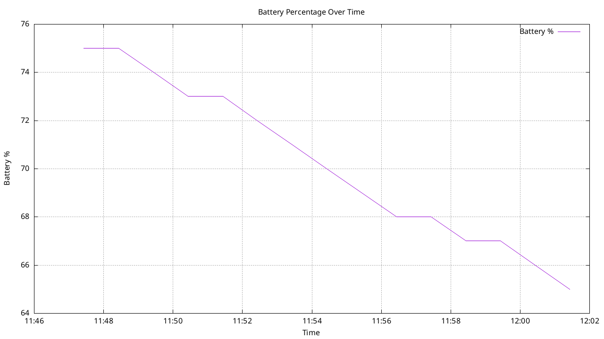

## 🔍 Battery Logger & Visualizer 🔋

This project is a lightweight and efficient battery monitoring toolkit designed for Linux systems (such as laptops or embedded devices). It logs battery statistics like charge percentage and current consumption over time, and offers two plotting options using either:

-   🐍 Python (`matplotlib`)

-   🌀 Gnuplot (via shell script)


It's especially useful for system monitoring, battery health diagnostics, or visualizing power behavior during long-running tasks.


---


A simple Linux-based toolkit to **log**, **monitor**, and **visualize battery performance over time**. Perfect for developers, tinkerers, or anyone wanting insights into their device’s battery behavior.

---

## 📦 Features

- ⏱️ Logs battery percentage and current every minute.
- 📊 Visualizes battery usage over time.
- 🐧 Designed for Linux systems using `/sys/class/power_supply`.
- 🌀 Choose between **Python** or **Gnuplot** for plotting.

---

## 📁 File Structure

| File                         | Description                                                  |
|-----------------------------|--------------------------------------------------------------|
| `battery_logger_data.sh`    | Logs battery percentage and current into `battery_log.csv`.  |
| `batter_health_graph_plotter.sh` | Uses Gnuplot to create a PNG plot from the log.              |
| `battery_logger_graphify.py`| Uses Python (matplotlib) to render a plot interactively.     |

---

## 🚀 Getting Started

### 🔧 Requirements

- For logging:
  - Linux system with battery metrics under `/sys/class/power_supply/BAT1`
  - the above can be changed according to the user's laptop just change the parameter `BAT1` respectively in the `battery_logger_data.sh`
- For Python plotting:
  - Python 3.x
  - `pandas`, `matplotlib`
- For Gnuplot plotting:
  - `gnuplot` installed

### 📥 Clone the Repo

```bash
git clone https://github.com/sanjitvk8/Battery_Plot.git
cd Battery_Plot/
````

---

## 📝 How to Use

### Step 1: Start Logging Battery Stats

```bash
chmod +x battery_logger_data.sh
./battery_logger_data.sh
```

> 🕐 Logs battery percentage & current every 60 seconds into `battery_log.csv`.

---

### Step 2: Visualize Using Python

```bash
python3 battery_logger_graphify.py
```

> 📈 Opens an interactive plot of battery % over time.

---

### OR: Visualize Using Gnuplot (PNG Output)

```bash
chmod +x battery_health_graph_plotter.sh
./battery_health_graph_plotter.sh
```

> 🖼️ Outputs `battery_plot.png` with battery trend graph.

---

## 📌 Notes

-   You can adjust the polling interval by modifying the `sleep` value in `battery_logger_data.sh`.

-   Make sure the battery path `/sys/class/power_supply/BAT1` matches your system (some systems use `BAT0`).


---

## 📷 Sample Output (Gnuplot)



---

## 🛠️ Contributing

Feel free to fork, improve logging precision, or add more data metrics (like voltage or temperature).

---

## 🧑‍💻 Author

Crafted with 🔥 and caffeine by [Sandrioo](https://github.com/sanjitvk8)


---

## 📄 License

[MIT License](LICENSE) – feel free to use and modify!


